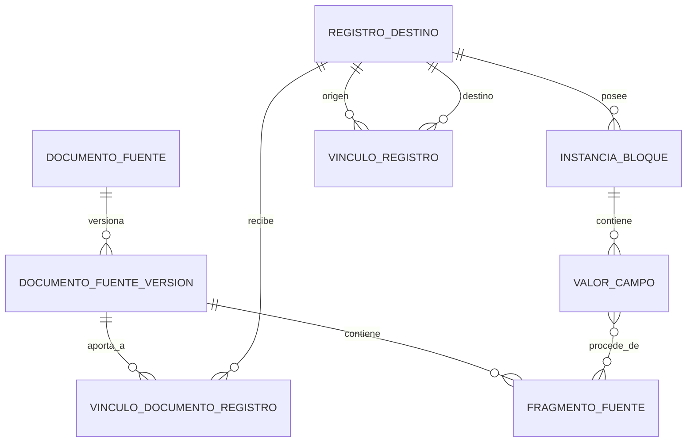

# Modelo conceptual canónico candidato — DEV-003

## Alcance y estado

Este documento define conceptos y relaciones capaces de conservar los maestros actuales, CIMA estructurado, las fichas técnicas y los bloques repetibles. No define tablas físicas, migraciones, API ni formato de exportación. Es evidencia para ADR-0001, que continúa **propuesto**.

Fuentes usadas: especificación v2, `SOURCE_INVENTORY.md`, perfil agregado reproducible de DEV-002, catálogo clínico y las 22 hojas de `OMEPRAZOL 20 MGrelleno.xlsx`. Los demás maestros solo se usan como contraste estructural. Los duplicados se conservan como observaciones; no se clasifican como errores.

## Conceptos

- **documento_fuente**: identidad lógica de un artefacto externo del que se obtiene evidencia. Puede ser un libro maestro, un recurso estructurado CIMA o una ficha técnica. Agrupa versiones, pero no contiene por sí mismo valores mutables ni equivale a un registro destino.
- **documento_fuente_version**: captura inmutable y verificable de un documento fuente en un momento determinado. Conserva hash, localizador de origen, formato, fecha de adquisición y, cuando exista, identificador o versión declarada por el proveedor. Dos contenidos distintos son versiones distintas; no se sobrescriben.
- **fragmento_fuente**: localizador literal dentro de una versión: libro/hoja/fila material/columna, ruta JSON o sección y posición de ficha técnica. Permite citar un valor sin convertir la coordenada en identidad de negocio.
- **registro_destino**: sujeto conceptual al que se atribuyen bloques y valores consolidados. Es independiente de cualquier fila o documento fuente y declara un tipo de entidad. Su identidad de negocio queda abierta cuando la evidencia no demuestra una clave.
- **instancia_bloque**: una ocurrencia explícita y ordenable de un bloque para un registro destino. Dos filas iguales siguen siendo dos instancias si proceden de dos ocurrencias fuente. Una instancia guarda su tipo de bloque, ordinal de ocurrencia y procedencia; nunca concatena ocurrencias.
- **valor_campo**: valor de un campo dentro de una instancia de bloque. Conserva valor literal, tipo observado, estado explícito y uno o más vínculos de procedencia. Cualquier valor normalizado o decidido se conserva como aseveración adicional, con regla o decisión y autor, sin sustituir el original.
- **vinculo_documento_registro**: relación tipada y, si procede, temporal entre una versión fuente y uno o varios registros destino. Evita suponer que una ficha o un libro corresponden a un único destino.
- **vinculo_registro**: relación tipada entre registros destino, con procedencia y vigencia. Permite representar composición, presentación y otras relaciones sin cerrar todavía sus cardinalidades de negocio.

## Diagrama conceptual

Las cardinalidades del diagrama expresan capacidad de representación, no cardinalidades farmacéuticas aceptadas. En particular, no cierran D-004 ni D-006.

## Entidades destino candidatas

| Entidad | Evidencia | Relación observada | Identidad o clave candidata | Estado |
|---|---|---|---|---|
| principio activo | Hojas `Principio activo -*` y maestro específico | participa en composición de medicamento | identificadores del proveedor observados; no demostrados como clave natural canónica | candidata |
| medicamento | Hojas `Medicamento -*` y maestro específico | agrupa composición, indicaciones, vías, frecuencias, prescripción y enlaces | identificadores del proveedor observados; no demostrados como clave natural canónica | candidata |
| especialidad/presentación | Hojas `Especialidad -*`; maestro con CN y referencia a medicamento | presentación comercial relacionada con medicamento | CN e identificadores del proveedor son candidatos, no equivalencias aceptadas | candidata; nombre y frontera pendientes |
| autorización CIMA | ficha técnica asociada a `nregistro` en la especificación | puede vincular documento CIMA con una o varias presentaciones | `nregistro` es identificador fuente candidato; alcance temporal y unicidad pendientes | candidata |
| concepto transversal | Grupo terapéutico, alergia, enfermedad, estado de riesgo e intolerancia en el ejemplo | clasifica o relaciona otros registros | no demostrada | abierta |
| interacción | hojas de ejemplo y maestro separado | relación clínica reutilizable/aplicable | fuera del piloto de extracción; identidad pendiente en su línea separada | fuera de alcance de cierre |

No se afirma que `medicamento`, `especialidad` y `autorización CIMA` sean equivalentes. El modelo admite relaciones tipadas N:M hasta que DEV-004/DEV-005 aporten evidencia y validación humana.

## Tabla de bloques, cardinalidad y claves

| Entidad/ámbito | Bloque u hojas de evidencia | Cardinalidad que el modelo debe soportar | Clave candidata de ocurrencia | Conclusión |
|---|---|---:|---|---|
| principio activo | General+DMAX | 0..N conservador | localizador de ocurrencia fuente | la plantilla no demuestra 1:1 canónico |
| principio activo | Frecuencias, Vías, Consejos, DAnaliticos | 0..N | ninguna natural demostrada; ordinal + procedencia preservan la ocurrencia | repetible |
| medicamento | General | 0..N conservador | localizador de ocurrencia fuente | dos filas duplicadas observadas no se eliminan ni se califican como error |
| medicamento | Composición, Indicaciones, Frecuencias, Vías, Info prescripción, Links | 0..N | posibles identificadores y campos de negocio requieren DEV-004 | repetible |
| especialidad | General | 0..N conservador | CN/identificadores solo candidatos de registro, no de ocurrencia | no se cierra 1:1 |
| especialidad | Excipientes | 0..N | ninguna natural demostrada | repetible |
| transversal | Grupo Terapéutico, Alergias, Enf.Congénita, Enf.Crónica, Est. Riesgo, Intolerancia | 0..N | ninguna natural demostrada | repetible o relacional; frontera pendiente |
| interacción | Interacciones, Interacciones - GP | 0..N | pendiente en línea separada | representable, no resuelta aquí |

`(documento_fuente_version, hoja o fragmento, ordinal_fila_material)` es una identidad técnica reproducible de la ocurrencia importada. No se presenta como clave natural ni permite fusionar filas. Las claves naturales o compuestas de negocio quedan abiertas salvo validación posterior. Los rótulos `0..M` y `1..5` observados en la plantilla son declaraciones pendientes de validación, no restricciones aceptadas.

## Relación entre identificadores y conceptos

- `nregistro` se observa como identificador de autorización/documento CIMA, no como sustituto automático del CN.
- CN se observa asociado a especialidad o presentación comercial, pero su estabilidad temporal, unicidad y granularidad deben verificarse.
- medicamento representa el nivel al que los maestros adjuntan composición y varios bloques clínicos.
- especialidad/presentación representa el nivel comercial que referencia medicamento y al que se adjuntan, entre otros, excipientes.
- principio activo se relaciona con medicamento mediante ocurrencias de composición.

El modelo conserva todas estas referencias como identificadores con sistema emisor y como vínculos tipados con procedencia. No fusiona registros porque compartan un texto o identificador parcial. La cardinalidad exacta entre los cinco conceptos es D-006 y continúa abierta.

## Procedencia por valor

Cada valor debe poder responder quién lo afirmó, de qué contenido exacto salió y qué transformación sufrió. Como mínimo conserva:

1. documento fuente y versión inmutable, incluido hash;
2. fragmento literal: hoja/fila material/columna, ruta estructurada o sección de ficha;
3. valor literal y tipo observado, sin normalización implícita;
4. instancia y ordinal del bloque al que pertenecía;
5. regla versionada para cualquier derivación, con referencias a sus entradas;
6. actor, instante y valor anterior para una decisión humana;
7. fuente de autoridad y vigencia cuando se consoliden afirmaciones en conflicto.

## Demostración documental con omeprazol

DEV-002 perfiló las 22 hojas del ejemplo. Es una plantilla vertical de definición/evaluación: una fila material no equivale automáticamente a una ocurrencia farmacéutica. La construcción conceptual sin pérdida es:

1. crear un `documento_fuente` lógico y una `documento_fuente_version` identificada por el hash original;
2. preservar cada fragmento material al importar en DEV-007, con hoja, coordenada/ordinal, cabecera literal y tipo; DEV-003 solo define esa capacidad y no materializa celdas;
3. resolver o crear provisionalmente los registros destino sin fusionarlos por comodidad;
4. crear una `instancia_bloque` por cada ocurrencia identificada, manteniendo hoja y ordinal, incluso si dos ocurrencias tienen los mismos valores;
5. crear un `valor_campo` literal por campo y enlazarlo a su fragmento;
6. conservar las relaciones entre registros como vínculos tipados, sin exigir que su cardinalidad ya esté cerrada.

Cobertura observada: cinco hojas de principio activo, siete de medicamento, dos de especialidad, seis transversales y dos de interacciones. Todas se asignan a un tipo de bloque con capacidad 0..N; por tanto, ninguna ocurrencia necesita concatenarse ni descartarse. Esto demuestra **capacidad de representación** de las 22 hojas, no el round-trip ejecutado: los recuentos, ocurrencias y valores se conciliarán en DEV-007/DEV-008.

## Decisiones aplicadas o ya cerradas

- D-003: las ocurrencias repetibles son explícitas y no se concatenan.
- D-007: los maestros existentes permanecen como línea base con procedencia y se consolidarán con fuentes adicionales.
- D-009: interacciones sigue una línea separada de migración y conciliación.
- La inmutabilidad de originales, la ausencia de normalizaciones implícitas y la conservación de duplicados son restricciones, no nuevas decisiones de identidad.

## Decisiones abiertas

- D-001: unidad exacta de revisión farmacéutica.
- D-002: aceptación del modelo documento/versión/registro/vínculo propuesto.
- D-004: claves naturales o compuestas y reglas de identidad por bloque.
- D-005: semántica operativa de `S`, `N`, `S*` y `N*`.
- D-006: cardinalidad e identidad entre `nregistro`, CN, autorización, medicamento, especialidad/presentación y principio activo.
- D-010: estados vacío, pendiente, `no_consta`, `no_aplica` y valor presente.
- D-020: política exacta de versionado y granularidad de fragmentos.
- Si las hojas `General` son verdaderamente 1:1 por sujeto o admiten historial/múltiples afirmaciones.
- Si los conceptos transversales son entidades reutilizables, bloques propios o relaciones tipadas.
- Cuándo dos ocurrencias de distintas fuentes representan la misma afirmación y quién puede autorizar su conciliación.
- Qué tablas tipadas serían necesarias; no se decide antes de un esquema físico autorizado.

## Criterio de salida de DEV-003

El modelo candidato tiene un lugar explícito para cada hoja, fragmento material, ocurrencia repetida, valor literal y procedencia del ejemplo de omeprazol. No depende de concatenación, deduplicación ni claves de negocio supuestas. DEV-003 queda documentalmente completo; ADR-0001 permanece propuesto y no se inicia DEV-004.
